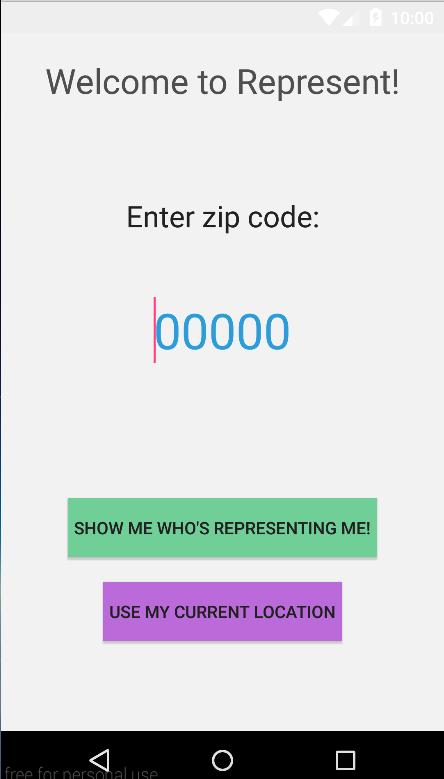
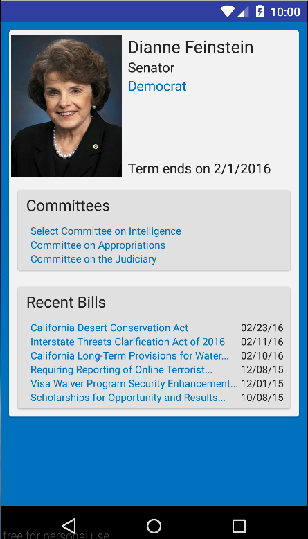

# PROG 02: Represent!

This application allows users to view the senators and representatives for a specific zip code or location, or uses their current location to show them who is representing them in the government. It also provides a quick view from the watch that allows users to view additional details (such as end of term date, committees they are on, and recent bills they have sponsored) if they wish to. In addition, the watch also supports a view that shows the results of the 2012 presidential vote for the associated county.

## Authors

Austin Le ([austinhle@berkeley.edu](mailto:austinhle@berkeley.edu))

## Demo Video

See [CS 160 Spring 2016 PROG02C] (https://youtu.be/c76dcOYE4Ck)

## Screenshots

## Acknowledgments

* [Example code](stackoverflow.com/questions/2317428/android-i-want-to-shake-it) from StackOverflow to detect acceleration changes using sensor on watch
* Skeleton code provided by CS160 staff for communication and message-passing between phone and watch as well as advice to use 2D picker for watch screens
* [Example code](http://stackoverflow.com/questions/2471935/how-to-load-an-imageview-by-url-in-android) from StackOverflow on how to load images into an Android ImageView given a URL.
